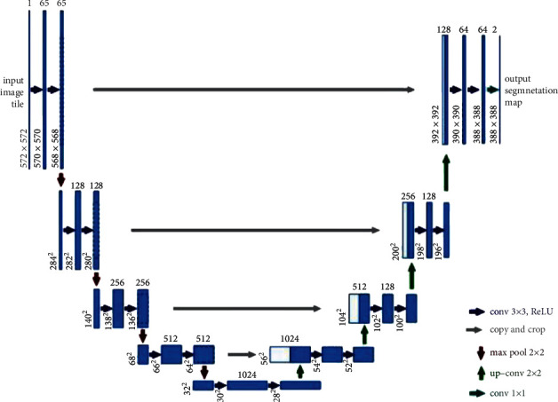

# Lung Cancer Segmentation using CT Scan Dataset
# Overview
This project focuses on lung cancer segmentation utilizing CT scan datasets. The objective is to develop a machine learning model based on the U-NET architecture (Convolutional Networks for Biomedical Image Segmentation) to accurately segment lung tumors from CT scan images.

# Table of Contents
1.Background

2.Dataset

3.Model

4.Methodology

5.How To Run

6.Contributors

# Background
Lung cancer remains a significant health concern worldwide, and early detection through image segmentation can greatly assist in diagnosis and treatment planning. This project employs the UNET architecture, known for its ability to generate high-quality segmentations from medical imaging data.

# Dataset
The dataset used for this project comprises CT scan images of lung cancer patients. This dataset contains 20 CT scans of patients diagnosed with COVID-19 as well as segmentations of lungs and infections made by experts. The original dataset is taken from(https://www.kaggle.com/datasets/andrewmvd/covid19-ct-scans/data), downloaded it and done the pre-processing. Instructions on accessing and preprocessing the data are provided in the Jupyter Notebook.

# Model

# Methodology
The lung cancer segmentation model is built using the UNET architecture, incorporating segmentation, deep learning techniques. This deep neural network is implemented with Keras functional API, which makes it extremely easy to experiment with different interesting architectures. 
Sigmoid activation function makes sure that mask pixels are in [0, 1] range. The detailed methodology and code implementation can be found in the provided Jupyter Notebook.
The model's performance metrics and visualized segmentation outputs are detailed in the Jupyter Notebook. The model is trained for 8 epochs.

Follow the instructions in the Jupyter Notebook (file.ipynb) to set up the environment and preprocess the data.
Execute the code cells in the notebook to train the model or perform inference.

# Contributors
B. Sai Ashrith Vardhan, Rajesh Mali, Rakesh Gonela

